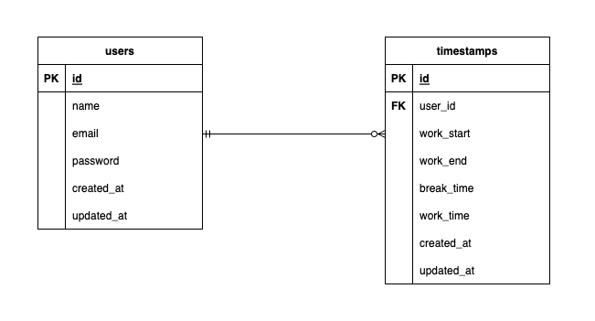

# atte(勤怠管理システム)

## 機能一覧

- 会員登録機能
- ログイン機能
- 勤怠打刻機能
- 日付別勤怠情報一覧

## 使用技術(実行環境)

- PHP 8.2.8
- Laravel 8.83.27
- MySQL 8.0.26

## 環境構築

**Docker ビルド**

1. ディレクトリの作成
2. docker-compose.yml の作成
3. Nginx の設定
4. PHP の設定
5. MySQL の設定
6. phpMyAdmin の設定
7. DockerDesktop アプリを立ち上げる
8. `docker-compose up -d --build`

**Laravel 環境構築**

1. `docker-compose exec php bash`
2. `composer install`

3. マイグレーションの実行

```bash
php artisan migrate
```

## ER 図



## URL

- 開発環境：http://localhost/
- phpMyAdmin：http://localhost:8080/
